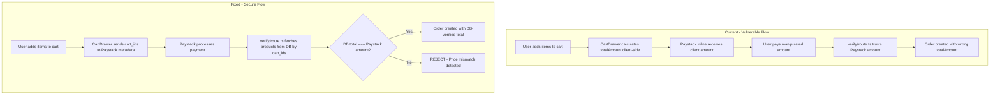

# Collins Academy — Full Security Audit & Remediation Plan

---

## Phase 1: Red Team Audit (Vulnerability Detection)

---

### 🔴 CRITICAL: Client-Side Price Tampering

#### Two Payment Flows Detected

The codebase has **two distinct payment flows**, which complicates the attack surface:

**Flow A — Direct Paystack Inline (CartDrawer.tsx → success page)**
- [`CartDrawer.tsx`](components/shop/CartDrawer.tsx:14) calculates `totalAmount` client-side at line 14
- [`CartDrawer.tsx`](components/shop/CartDrawer.tsx:45) sends `amount: totalAmount * 100` directly to Paystack Inline at line 45
- On success callback at line 61, redirects to `/success?reference=...`
- [`route.ts`](app/api/payment/verify/route.ts:79) at line 79 **blindly trusts** `paystackData.data.amount` and saves it as `totalAmount`

**Flow B — Server-Initialized (checkout/route.ts → Paystack Initialize API)**
- [`checkout/route.ts`](app/api/checkout/route.ts:47) receives `items` from the client body at line 47
- It calculates price from `item.priceNGN` / `item.priceUSD` — **but these are client-supplied values, NOT fetched from DB**
- This means a user can POST `{ items: [{ _id: "real-id", priceNGN: 1, priceUSD: 0.01 }] }` and the server will happily initialize a ₦1 transaction

---

#### 🛑 Vulnerability 1: Price Tampering via Paystack Inline (Flow A)

**The Risk:** A user can modify the `totalAmount` JavaScript variable in the browser console, or intercept the Paystack Inline `setup()` call, to pay ₦100 for ₦50,000 worth of books. The backend at [`route.ts:79`](app/api/payment/verify/route.ts:79) saves `paystackData.data.amount / 100` as the order total without ever comparing it to the actual DB prices of the products in `cart_ids`.

**Evidence:**
- [`CartDrawer.tsx:14`](components/shop/CartDrawer.tsx:14) — `totalAmount` computed from client-side Zustand store
- [`CartDrawer.tsx:45`](components/shop/CartDrawer.tsx:45) — `amount: totalAmount * 100` sent to Paystack
- [`route.ts:63`](app/api/payment/verify/route.ts:63) — Products ARE fetched from DB via `cart_ids`
- [`route.ts:79`](app/api/payment/verify/route.ts:79) — But `totalAmount` is set from Paystack's reported amount, **NOT** from the sum of DB prices
- [`route.ts:85-91`](app/api/payment/verify/route.ts:85) — Individual item prices ARE correctly pulled from DB for the order items, but the `totalAmount` field is never validated against them

**Severity:** 🔴 CRITICAL — Full price bypass. User gets digital products for any amount they choose.

---

#### 🛑 Vulnerability 2: Price Tampering via Checkout API (Flow B)

**The Risk:** The [`checkout/route.ts`](app/api/checkout/route.ts:47) endpoint trusts client-supplied `item.priceNGN` and `item.priceUSD` values. An attacker can POST a request with real product `_id`s but fake prices of ₦1 each. The server will initialize a Paystack transaction for ₦1.

**Evidence:**
- [`checkout/route.ts:47-49`](app/api/checkout/route.ts:47) — `const price = currency === "NGN" ? item.priceNGN : item.priceUSD;` — prices come from the request body
- No `Product.find()` call exists in this route to verify prices against the database

**Severity:** 🔴 CRITICAL — Full price bypass via API manipulation.

---

### 🟡 Data Integrity & Injection

#### 🛑 Vulnerability 3: NoSQL Injection via Library API (RegExp Injection)

**The Risk:** In [`app/api/library/route.ts:18`](app/api/library/route.ts:18), the user-supplied `email` is directly interpolated into a `RegExp` constructor: `new RegExp('^${email}$', 'i')`. An attacker can send a payload like `{"email": ".*"}` which becomes `new RegExp('^.*$', 'i')` — matching ALL emails in the database, dumping every user's order history and download links.

**Evidence:**
```typescript
// line 18 — VULNERABLE
customerEmail: { $regex: new RegExp(`^${email}$`, 'i') }
```

A more dangerous payload: `{"email": "^)($"}` would crash the server with an invalid RegExp error (unhandled 500).

**Severity:** 🟠 HIGH — Information disclosure (all orders/download URLs) + potential DoS via malformed regex.

---

#### 🛑 Vulnerability 4: Malformed cart_ids Can Create Ghost Orders

**The Risk:** In [`route.ts:57-63`](app/api/payment/verify/route.ts:57), `cart_ids` come from Paystack metadata which was originally set by the client. If a user sends fake/non-existent MongoDB ObjectIds, `Product.find({ _id: { $in: cartIds } })` returns an empty array, but the code at line 59 only checks `if (!cartIds.length)` — it does NOT check if `products.length === 0`. This creates an order with `items: []` and `totalAmount` from whatever Paystack reports.

Additionally, if a `cart_id` is not a valid ObjectId format (e.g., `"AAAA"`), Mongoose will throw a `CastError` which is caught by the generic catch block and returns a 500 error — but this leaks the error message at [`route.ts:112`](app/api/payment/verify/route.ts:112): `error.message`.

**Evidence:**
- [`route.ts:57`](app/api/payment/verify/route.ts:57) — `const cartIds = meta?.cart_ids || [];`
- [`route.ts:63`](app/api/payment/verify/route.ts:63) — `const products = await Product.find({ _id: { $in: cartIds } });`
- No validation that `products.length === cartIds.length`
- No ObjectId format validation

**Severity:** 🟡 MEDIUM — Ghost orders with empty items; potential error message leakage.

---

#### 🟢 Vulnerability 5: LeadMagnet.tsx Email — No Backend Risk (Currently)

**The Risk:** The [`LeadMagnet.tsx`](components/home/LeadMagnet.tsx:10) email form at line 10-14 currently does NOT make any API call — it just simulates with `setTimeout`. There is no NoSQL injection risk here **today**, but if a backend endpoint is added later without sanitization, it would become vulnerable.

**Evidence:**
```typescript
// line 13 — No API call, just a simulation
setTimeout(() => setStatus("success"), 1500);
```

**Severity:** 🟢 LOW — No current risk, but flagged for future awareness.

---

#### 🟢 Vulnerability 6: LibraryPage.tsx Client-Side Email

**The Risk:** The [`LibraryPage.tsx`](app/library/page.tsx:74) uses `type="email"` on the input, which provides basic browser validation. However, the real vulnerability is on the **server side** at [`app/api/library/route.ts:18`](app/api/library/route.ts:18) (covered in Vulnerability 3). The client-side input itself is not a direct injection vector since the attack would be done via direct API calls anyway.

**Severity:** 🟢 LOW — Client-side validation is a UX feature, not a security boundary.

---

### 🟡 Concurrency & Idempotency

#### 🛑 Vulnerability 7: Duplicate Order Prevention — Partially Implemented

**The Risk:** The [`route.ts:31`](app/api/payment/verify/route.ts:31) does check for existing orders via `Order.findOne({ transactionId: reference })`. This prevents duplicate orders if the success callback fires twice. **However**, there is a race condition: if two requests arrive simultaneously with the same `reference`, both could pass the `findOne` check before either creates the order, resulting in two orders.

**Evidence:**
- [`route.ts:31`](app/api/payment/verify/route.ts:31) — `const existingOrder = await Order.findOne({ transactionId: reference });`
- [`route.ts:69`](app/api/payment/verify/route.ts:69) — `await Order.create({...})` — no unique index enforcement
- [`models/Order.ts:22`](models/Order.ts:22) — `transactionId: { type: String }` — **no `unique: true` constraint**

**Severity:** 🟡 MEDIUM — Race condition can create duplicate orders under concurrent requests.

---

#### Additional Note: Checkout Route Creates Pre-Orders

The [`checkout/route.ts:58`](app/api/checkout/route.ts:58) creates an order with `status: "pending"` BEFORE payment. But the [`verify/route.ts`](app/api/payment/verify/route.ts) creates a SEPARATE order with `status: "success"` after payment. This means every checkout attempt creates a pending order that is never cleaned up or linked to the verification flow. The verify route uses `cart_ids` from Paystack metadata (Flow A) while checkout uses `orderId` in metadata (Flow B). These are **two disconnected flows**.

---

## Phase 2: Blue Team Remediation (Execution Plan)

### Fix 1: Server-Side Price Verification in `verify/route.ts`

**File:** [`app/api/payment/verify/route.ts`](app/api/payment/verify/route.ts)

**Changes Required:**
1. After fetching products from DB via `cart_ids`, sum their prices
2. Compare the DB-calculated total against `paystackData.data.amount / 100`
3. Reject the transaction if values don't match (with a small tolerance for rounding)
4. Validate that `cart_ids` are valid MongoDB ObjectIds before querying
5. Validate that `products.length === cartIds.length` (no missing products)
6. Add `unique: true` to `transactionId` in the Order model
7. Remove `: any` type annotations and replace with proper interfaces
8. Sanitize all inputs

### Fix 2: Server-Side Price Verification in `checkout/route.ts`

**File:** [`app/api/checkout/route.ts`](app/api/checkout/route.ts)

**Changes Required:**
1. Fetch products from DB using the provided `_id`s instead of trusting client prices
2. Calculate `revenueAmount` from DB prices, not client-supplied prices
3. Validate all product IDs exist in the database

### Fix 3: NoSQL Injection Prevention in `library/route.ts`

**File:** [`app/api/library/route.ts`](app/api/library/route.ts)

**Changes Required:**
1. Replace `$regex` with exact string match using `.toLowerCase()` on both sides
2. Or escape special regex characters before constructing the RegExp
3. Add email format validation before querying

### Fix 4: Button Types in `CartDrawer.tsx`

**File:** [`components/shop/CartDrawer.tsx`](components/shop/CartDrawer.tsx)

**Changes Required:**
1. Add `type="button"` to the close button (line 105)
2. Add `type="button"` to currency toggle buttons (line 112)
3. Add `type="button"` to the checkout button (line 177) — already not in a form, but defensive
4. The delete button at line 146 already has `type="button"` ✅

### Fix 5: Order Model — Add Unique Constraint

**File:** [`models/Order.ts`](models/Order.ts)

**Changes Required:**
1. Add `unique: true, sparse: true` to `transactionId` field to prevent duplicate orders at the DB level

---

## Phase 3: Production Polish (UX & A11y)

### Theme Hardcoding Issues Found

| File | Line | Hardcoded Value | Fix |
|------|------|----------------|-----|
| [`Hero.tsx`](components/home/Hero.tsx:76) | 76 | `bg-[#d4af37]` | Replace with `bg-gold` |
| [`Hero.tsx`](components/home/Hero.tsx:89) | 89 | `text-[#d4af37]` | Replace with `text-gold` |
| [`Hero.tsx`](components/home/Hero.tsx:117) | 117 | `border-[#d4af37]/50 bg-[#d4af37]/10` | Replace with `border-gold/50 bg-gold/10` |
| [`Hero.tsx`](components/home/Hero.tsx:121) | 121 | `bg-[#d4af37] text-black` | Replace with `bg-gold text-black` |
| [`WhatsAppFloat.tsx`](components/ui/WhatsAppFloat.tsx:13) | 13 | `bg-[#25D366]` and `hover:bg-[#128C7E]` | Keep — these are WhatsApp brand colors, not theme colors |
| [`WhatsAppFloat.tsx`](components/ui/WhatsAppFloat.tsx:18) | 18 | `bg-white text-black` | Replace with `bg-card text-card-foreground` |
| [`ModeToggle.tsx`](components/ui/ModeToggle.tsx:19) | 19 | `bg-white/5` | Replace with `bg-muted-foreground/5` or keep (skeleton) |
| [`ModeToggle.tsx`](components/ui/ModeToggle.tsx:30) | 30 | `bg-white text-black` | These are intentional for the toggle pill indicator — acceptable |
| [`success/page.tsx`](app/success/page.tsx:96) | 96 | `hover:bg-white` | Replace with `hover:bg-foreground hover:text-background` |
| [`Book3D.tsx`](components/ui/Book3D.tsx:106) | 106 | `hover:bg-white` | Replace with `hover:bg-foreground hover:text-background` |

### Accessibility Issues Found

| File | Line | Issue | Fix |
|------|------|-------|-----|
| [`Header.tsx`](components/layout/Header.tsx:161) | 161-201 | Mobile menu does NOT trap focus | Add focus trap logic |
| [`Footer.tsx`](components/layout/Footer.tsx:49) | 49-51 | Social icon links have no `aria-label` | Add `aria-label="Instagram"` etc. |
| [`CartDrawer.tsx`](components/shop/CartDrawer.tsx:105) | 105 | Close button has no `aria-label` | Add `aria-label="Close cart"` |
| [`CartDrawer.tsx`](components/shop/CartDrawer.tsx:145) | 145-149 | Delete button has no `aria-label` | Add `aria-label="Remove item"` |
| [`Book3D.tsx`](components/ui/Book3D.tsx:101) | 101 | Add to cart button has no `aria-label` | Add `aria-label="Add to cart"` |
| [`WhatsAppFloat.tsx`](components/ui/WhatsAppFloat.tsx:7) | 7 | Link has no `aria-label` | Add `aria-label="Chat with us on WhatsApp"` |
| [`LibraryPage.tsx`](app/library/page.tsx:142) | 142 | Download button — OK, has text content | ✅ |

### Type Safety — `: any` Instances Found

| File | Line | Current | Required Interface |
|------|------|---------|-------------------|
| [`success/page.tsx`](app/success/page.tsx:25) | 25 | `useState<any>(null)` | Needs `Order` interface |
| [`success/page.tsx`](app/success/page.tsx:50) | 50 | `catch (err: any)` | Use `catch (err: unknown)` |
| [`checkout/success/page.tsx`](app/checkout/success/page.tsx:15) | 15 | `useState<any>(null)` | Needs `Order` interface |
| [`checkout/success/page.tsx`](app/checkout/success/page.tsx:34) | 34 | `catch (err: any)` | Use `catch (err: unknown)` |
| [`checkout/success/page.tsx`](app/checkout/success/page.tsx:101) | 101 | `order.items.map((item: any` | Use `OrderItem` interface |
| [`library/page.tsx`](app/library/page.tsx:12) | 12 | `useState<any[] \| null>(null)` | Needs `LibraryBook` interface |
| [`route.ts verify`](app/api/payment/verify/route.ts:35) | 35,40,41 | Multiple `: any` | Needs `OrderDocument`, `ProductDocument` interfaces |
| [`route.ts checkout`](app/api/checkout/route.ts:47) | 47,61 | `(item: any)` | Needs `CheckoutItem` interface |
| [`route.ts verify`](app/api/payment/verify/route.ts:110) | 110 | `catch (error: any)` | Use `catch (error: unknown)` |
| [`Book3D.tsx`](components/ui/Book3D.tsx:9) | 9 | `book: any` | Needs `Product` interface |
| [`Hero.tsx`](components/home/Hero.tsx:22) | 22 | `as any` in easing | Use proper type |
| [`Hero.tsx`](components/home/Hero.tsx:29) | 29 | `useState<any>(null)` | Needs `DailyContent` interface |
| [`CartDrawer.tsx`](components/shop/CartDrawer.tsx:35) | 35 | `(window as any).PaystackPop` | Declare global `PaystackPop` type |
| [`CartDrawer.tsx`](components/shop/CartDrawer.tsx:57) | 57 | `callback: function(response: any)` | Needs `PaystackResponse` interface |
| [`library/route.ts`](app/api/library/route.ts:29) | 29,33 | `any[]` and `(item: any)` | Needs proper types |

---

## Execution Todo List (For Code Mode)

### Priority 1 — Security Critical
1. Fix [`app/api/payment/verify/route.ts`](app/api/payment/verify/route.ts) — Add server-side price verification, ObjectId validation, product count validation
2. Fix [`app/api/checkout/route.ts`](app/api/checkout/route.ts) — Fetch prices from DB instead of trusting client
3. Fix [`app/api/library/route.ts`](app/api/library/route.ts) — Remove RegExp injection, use exact match
4. Fix [`models/Order.ts`](models/Order.ts) — Add `unique: true` to `transactionId`

### Priority 2 — Data Integrity
5. Fix [`components/shop/CartDrawer.tsx`](components/shop/CartDrawer.tsx) — Add `type="button"`, `aria-label`s
6. Add proper TypeScript interfaces across all files

### Priority 3 — UX & A11y
7. Fix hardcoded hex colors in [`Hero.tsx`](components/home/Hero.tsx), [`Book3D.tsx`](components/ui/Book3D.tsx), [`success/page.tsx`](app/success/page.tsx), [`WhatsAppFloat.tsx`](components/ui/WhatsAppFloat.tsx)
8. Add `aria-label` to icon-only buttons in [`Footer.tsx`](components/layout/Footer.tsx), [`CartDrawer.tsx`](components/shop/CartDrawer.tsx), [`Book3D.tsx`](components/ui/Book3D.tsx), [`WhatsAppFloat.tsx`](components/ui/WhatsAppFloat.tsx)
9. Add focus trap to mobile menu in [`Header.tsx`](components/layout/Header.tsx)
10. Remove all `: any` types and add strict interfaces

---

## Architecture: Payment Flow (Current vs. Fixed)


